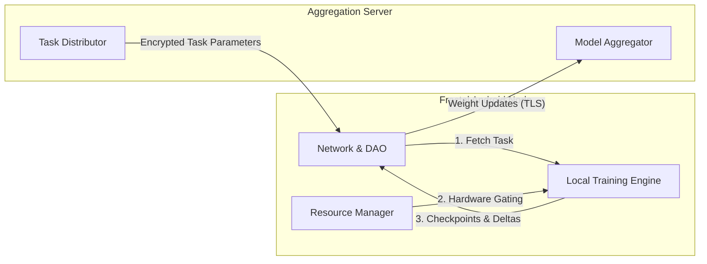
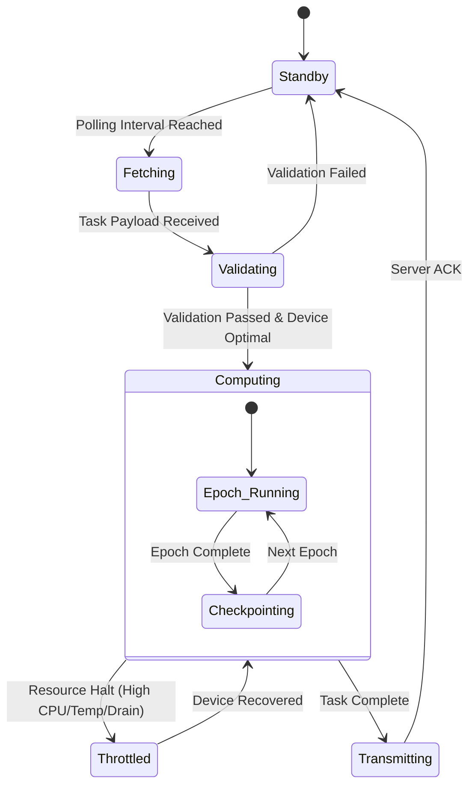

<div align="center">

# Fractal 

**Resource-Aware Edge Computing & Federated Learning Node for Android**

[](https://kotlinlang.org)
[](https://developer.android.com/studio)
[](#)
[](https://opensource.org/licenses/MIT)

<p align="center">
  <a href="#overview">Overview</a> •
  <a href="#system-architecture">Architecture</a> •
  <a href="#node-lifecycle">Lifecycle</a> •
  <a href="#getting-started">Getting Started</a>
</p>

</div>

---

## Overview

**Fractal** is an experimental, high-performance Android client engineered for distributed edge computing. It enables mobile devices to act as autonomous compute nodes within a federated network. By securely downloading training parameters and executing compute-heavy tasks locally, Fractal decentralizes machine learning workloads while preserving user privacy.

To ensure the host device's primary user experience is never degraded, Fractal implements a strict **Hardware Telemetry Gating** system. Background operations are dynamically throttled or halted based on real-time thermal, CPU, and battery constraints.

> **Note**
> This repository contains the Android Client (Edge Node) implementation. The Aggregation Server implementation is maintained in a separate repository.

---

## System Architecture

Fractal enforces a strict separation of concerns, decoupling the frontend telemetry interfaces (`AppFrontend`) from the core processing and transmission engines (`AppBackend`).



### Core Components

| Module | Sub-Component | Responsibility |
| --- | --- | --- |
| **`LocalTrainingModule`** | `Image_Trainer` | Primary execution environment for on-device dataset processing and epoch iterations. |
|  | `CheckpointManager` | Serializes `checkpoint_DTO` states to disk, ensuring fault tolerance and resume-capability. |
| **`ResourceManagement`** | `ResourceStatistics` | Aggregates live data on battery temperature, charging state, available RAM, and CPU. |
|  | `OperationControl` | The circuit-breaker. Consumes telemetry to dynamically grant/revoke compute locks. |
| **`Network`** | `Server_DAO` | Manages bidirectional authentication, node registration, and task population via HTTP/TLS. |
|  | `ModelTransmitter` | Compresses and transmits `ModelTransmission_DTO` payloads (parameter deltas). |

---

## Node Lifecycle

The client operates autonomously. Operations are strictly governed by the state machine below to ensure the host device remains stable.



---

## Codebase Structure

<details>
<summary><b>Click to expand project tree</b></summary>

```text
Fractal-Application/
├── app/src/main/java/
│   ├── AppBackend/
│   │   ├── DataManager/          # Caching, DTO factories, and initializers
│   │   ├── LocalTrainingModule/  # On-device model training execution logic
│   │   ├── Network/              # Transmission, DAOs, Auth & Registration
│   │   ├── ResourceManagement/   # Live CPU/RAM/Battery statistics tracking
│   │   ├── TaskContainer/        # Task parameters parsing (Image_Task)
│   │   └── Validator/            # Model Inference Validation
│   ├── AppFrontend/
│   │   ├── Auth/                 # Secure device binding / unregistering
│   │   ├── Home/                 # DiamondTrainingView & Main Dashboard
│   │   ├── Insights/             # Real-time analytics visualization fragments
│   │   └── Settings/             # Node configuration
│   └── AppGlobal/                # App-wide constants, Config & Utils
└── build.gradle.kts              # Kotlin DSL Build Scripts

```

</details>

---

## Getting Started

### Prerequisites

* **IDE**: Android Studio Jellyfish (2023.3.1) or higher.
* **Language**: Kotlin 1.9.0+
* **SDK**: Minimum API Level 24 (Android 7.0), Target API Level 34.
* **Environment**: A physical Android device is highly recommended over an emulator for accurate thermal and battery telemetry tracking.

### Build and Run

1. Clone the repository:
```bash
git clone [https://github.com/Ahmad-Hassan-0/Fractal-Application.git](https://github.com/Ahmad-Hassan-0/Fractal-Application.git)

```


2. Open the project directory in Android Studio.
3. Allow Gradle to sync and download the required dependencies.
4. Deploy the application to a connected physical device (`Shift + F10`).

---

## Privacy & Edge Security

Fractal is built around the principles of **Data Minimization** and localized processing:

* **Zero Data Exfiltration**: Raw input data (e.g., local images or user datasets) processed by the `Image_Trainer` never leaves the host device.
* **Differential Privacy Ready**: Only aggregated mathematical weight updates (`ModelTransmission_DTO`) are transmitted to the upstream aggregator. All transmissions are secured via standard TLS encryption.

---

<div align="center">
<i>Maintained by the Fractal Contributors. Licensed under MIT.</i>
</div>
